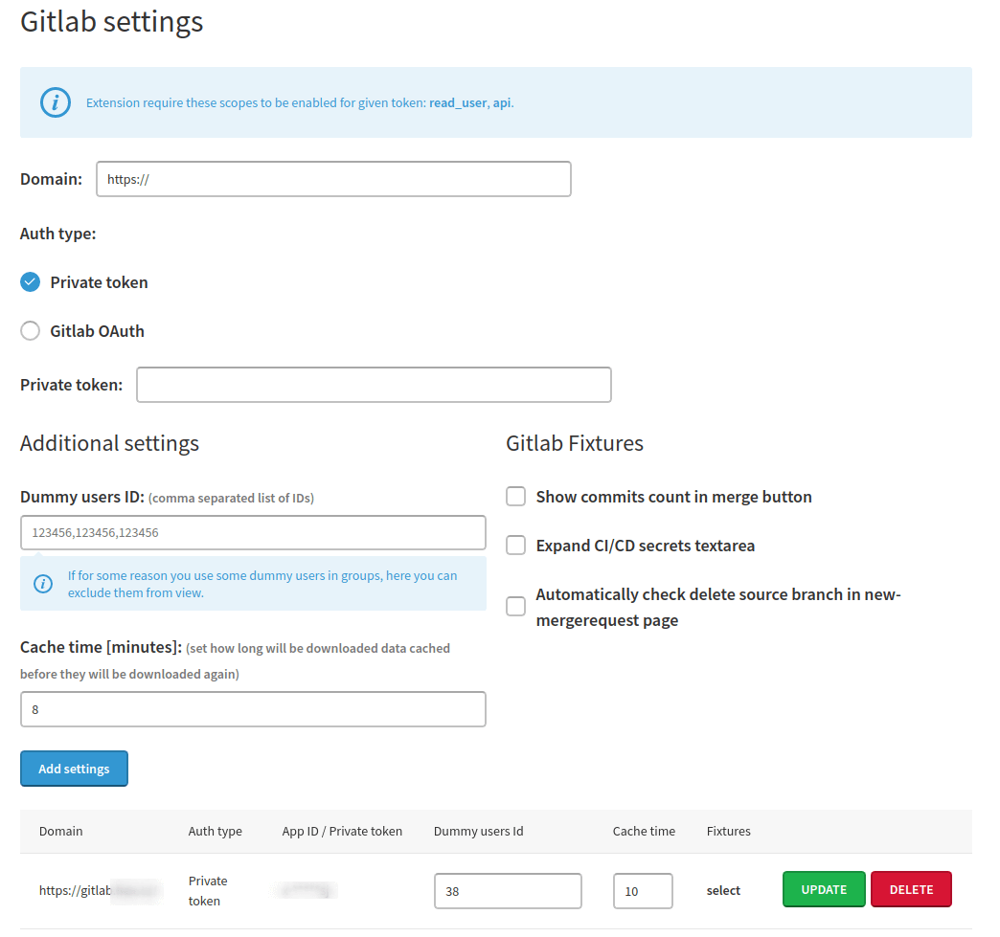
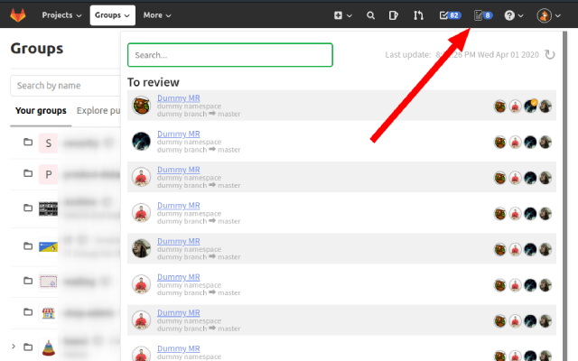
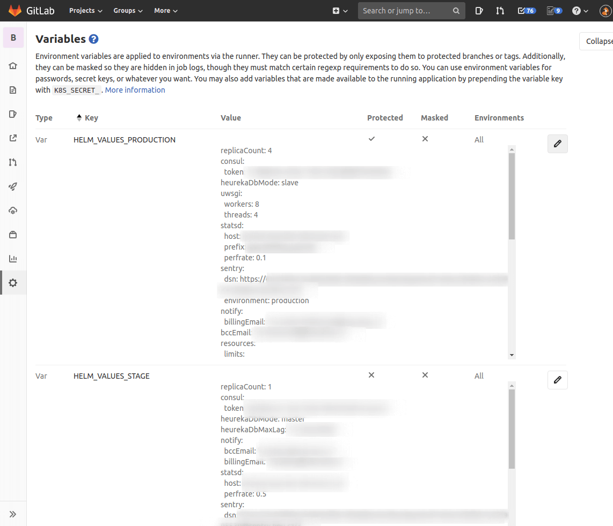

# Gitlab MR summary extension

Do you know the feeling when you start using a new service but want some features from the old one? I had this feeling when we started using Gitlab in HeurekaDevs after some time when we were using Bitbucket Stash and found that Gitlab has no summary of pending MRs for codereview, as Stash had. Yes, there are TODOs but they behave strangely and illogically so I decided to write this extension.

### How it works
Extension uses Gitlab API for getting all required data about projects and theirs MR requests and participants. Puts everything together and show as a list of merge-requests which waits to codereview and list of yours merge-requests.  

Since v2.0.0+ data are stored locally for some time (can be set on options page) and synced over all tabs with same domain as your Gitlab has, so no more waiting for download on new/next page. 

Personal access tokens can now have restricted read-only access (since Gitlab 12.10.0 (2020-04-22)), so for security reasons, I recommend using these restricted ones. All downloaded data are stored locally and they are downloaded again on some change (approve, merge). 

### Setup
1. Get extension for your browser
    - for [chrome](https://chrome.google.com/webstore/detail/gitlab-mr-summary/gekiikmjljplpkcmheahicdcbblkafki)
    - for [firefox](https://addons.mozilla.org/en-US/firefox/addon/gitlab-mr-summary/)
2. Set options of your Gitlab
    
    - for auth you can use 
        - [private access token](https://docs.gitlab.com/ee/user/profile/personal_access_tokens.html)
        - [OAuth2](https://docs.gitlab.com/ee/integration/oauth_provider.html)
            - redirect URI displays when you check this option
            - OAuth flow pops up when you first come to entered Gitlab domain
3. Go to your Gitlab domain and profit!



### Gitlab Fixtures
A collection of several scripts that make working with gitlab a little more comfortable.
1. Show commits count in merge button

If you are used to squash commits before merging and sometimes you forget it, first fixture will help a little bit.
2. Expand CI/CD secrets textarea
<p>


</p>
The second fixture helps with preview of variables (when you click on reveal values) and in edit modal window set bigger height for textarea.
3. Automatically check delete source branch in new-mergerequest page

And third one automatically check option *Delete source branch when merge request is accepted* on merge request create page.

### Develop
Run watch task 
```shell script
$ docker-compose build
$ docker-compose up
```
Pack extension to zip file for distributing (folder to `packed_extension`)
```shell script
$ docker-compose build
$ docker-compose -f docker-compose.yml -f docker-compose.pack.yml up
```
